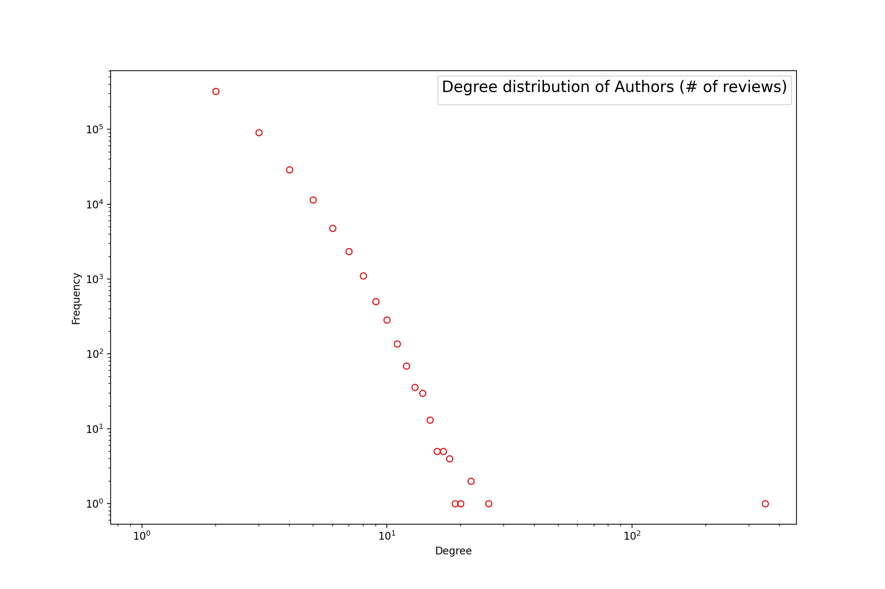
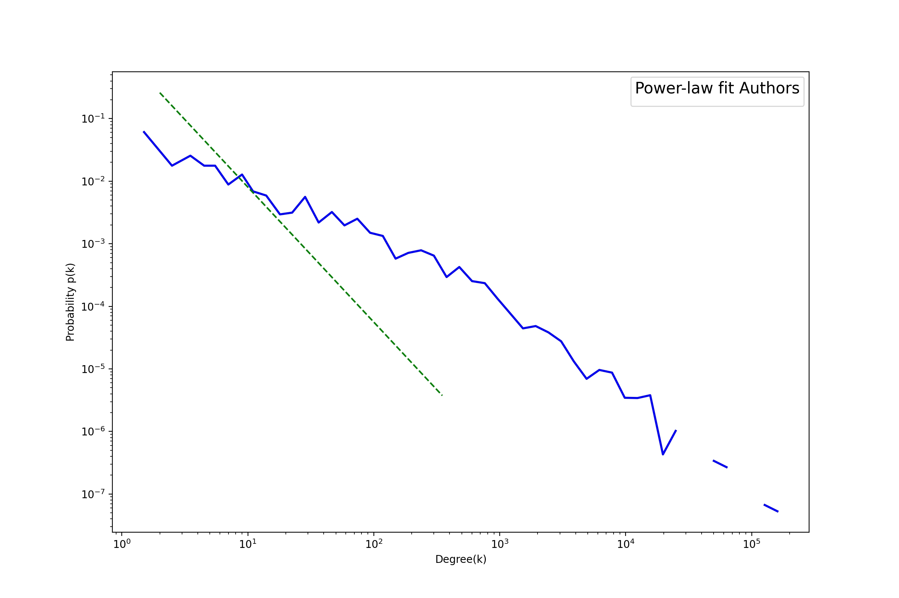

## Network 
This network is based on two files:
1. **frequency.csv**: This file contains the reviews of 523,620 with at least 2 reviews. The real number after preprocessing, however, is 462,682 authors.
2. **apps_names**: It has the 546 app's names (only 512 were taken into account)

### Sentiment 
The edge of this network is the sentiment prediction: red for negative, blue for positive and black for neutral. The red nodes is the app and the blue is autrors.

 

### How to execute
This script takes around 12 minutes to run. You need to have the Sentiment CSV files in our machine from the [GitLab](https://gitlab.com/jaimedantas/datasets/-/tree/master/sentiment) and update the path `mainPath` with your path.

In order to execute this script and have the network `G`, just execute the `main()` function as it is.

## Results
- Name: Topological Network Analysis
- Type: Graph
- Number of nodes: 463194
- Number of edges: 1154633
- Average degree:   4.9855
- Network density: 1.0763389306000118e-05
- Node degree average APP: 2255.435546875
- Node degree average Author: 2.4955217622470727
- Number of apps: 512
- Number of Authors: 462682
- Top 10 Authors:
('Lim Yen Ping', 26)
('Emanuel Seuneke', 22)
('Rhonda Paschal', 22)
('Filipe Governa', 20)
('Andri Untoro', 19)
('Janko Kinčeš', 18)
('Edgar Rojas', 18)
('Saman Kianfar', 18)
('Christina Reed', 18)
('Josh Clark', 17)

- Top 10 Apps:
('Google Photos', 178753)
('Google Duo - High Quality Video Calls', 119171)
('Candy Crush Soda Saga', 64653)
('Google Play Music', 59597)
('Candy Crush Saga', 49710)
('Mini Militia - Doodle Army 2', 44799)
('Candy Crush Jelly Saga', 27571)
('Castle Clash: Heroes of the Empire US', 25425)
('MX Player', 24601)
('Google Docs', 20269)

### 10 Apps for the time series analysis
('Google Photos'	 178753)
('Candy Crush Soda Saga'	 64653)
('EA SPORTS UFC®'	 16818)
('Adobe Photoshop Express:Photo Editor Collage Maker'	 14489)
('Real Racing 3'	 13421)
('Draw Something'	 6984)
('Adobe Lightroom - Photo Editor'	 6975)
('Draw Something Classic'	 6240)
('Microsoft Office Lens - PDF Scanner'	 5493)
('Flashlight: LED Light'	 2409)

### Degree distribution

 

 

Power-law distribution over the app degree:

 

Power-law distribution over the auth degree:

 

